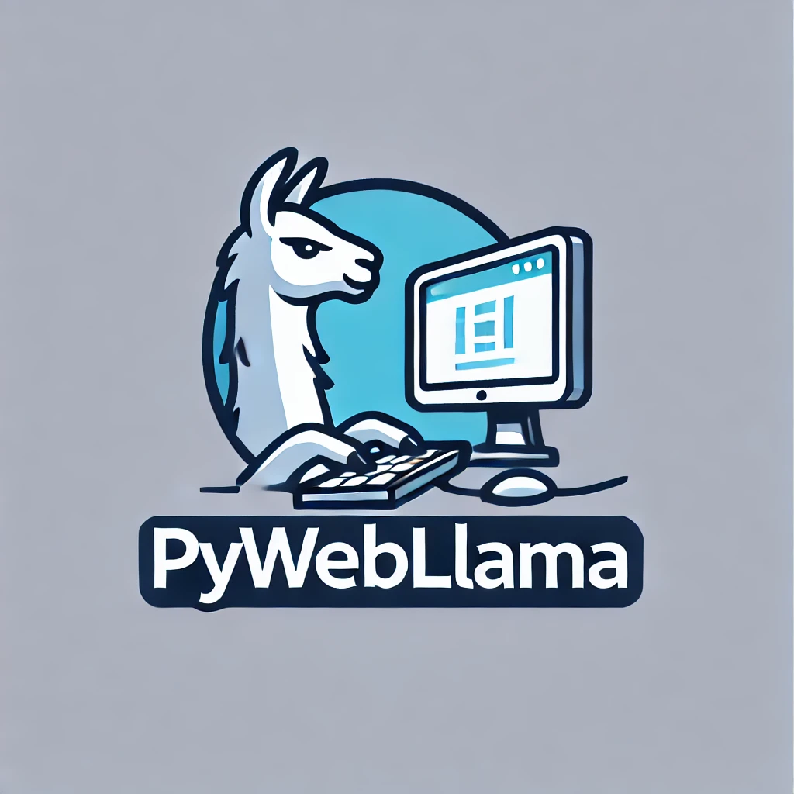

# PyWebLlama
  

Built at SPC Llamathon- Aug 2-4

## 📝 Description

* `PyWebLlama` is a web agent designed to help you perform web tasks via a simple natural language prompt.

* It takes in natural language instructions such as "order a Macbook Pro on Amazon", or "get me a large cheese pizza from ubereats", and performs actions on a website to 
complete the task for you.

* Models/frameworks used: We use Llama 3.1 70B as our main 'navigator' model. Llama calls into GPT-4o for summarizing the visual elements of webpages, and then decides on an action to take. Actions are orchestrated using Playwright (https://playwright.dev/). When getting visual info from GPT-4o, we also use SoM (set-of-marks) prompting (https://arxiv.org/abs/2310.11441).

* Acknowledgements: We'd like to thank the developer(s) of https://github.com/pywebagent/pywebagent, which we used in our work.
